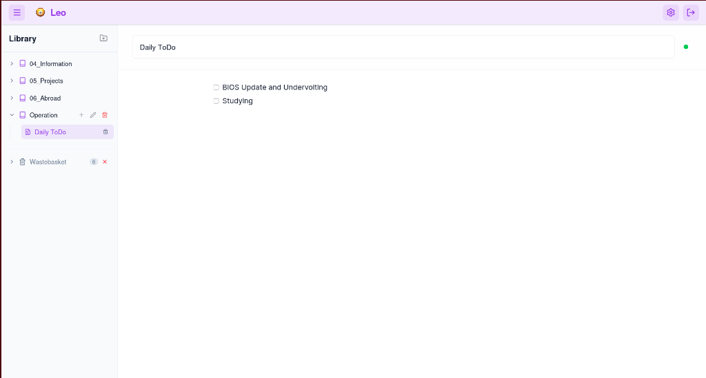
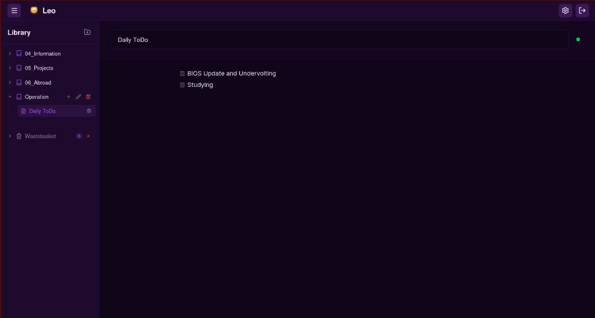
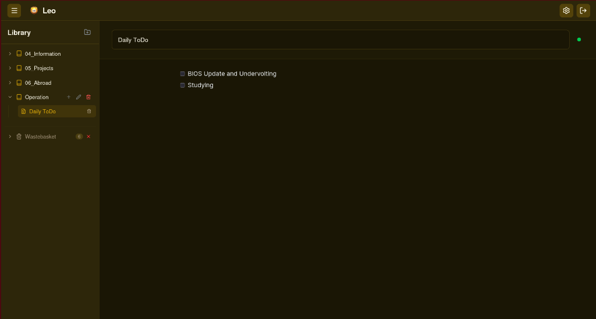

<div align="center">
  # 🦁 LEO
  ### Organize. Clarify. Create.

  [](https://react.dev/)
  [](https://www.typescriptlang.org/)
  [](https://tauri.app/)
  [](https://tailwindcss.com/)
  [](https://firebase.google.com/)

  **Leo** is a modern, high-performance, and decentralized note-taking application built for the next generation of creative thinkers. Combining the power of block-based editing with the speed of native desktop applications.

  [Explore Features](#-features) • [Installation](#-getting-started) • [Tech Stack](#%EF%B8%8F-tech-stack)
</div>

<hr />

## ✨ Features

- **📦 Block-Based Editing**: powered by [BlockNote](https://www.blocknotejs.org/), offering a Notion-like experience with blocks for text, images, lists, and more.
- **⚡ Native Performance**: Built with **Tauri**, providing a lightweight and blazing-fast desktop experience on Windows, macOS, and Linux.
- **🔄 Real-time Sync**: Seamless data synchronization across devices using **Firebase**, ensuring your notes are always up to date.
- **🎨 Premium UI/UX**: A stunning, modern interface built with **Mantine** and **Tailwind CSS**, featuring glassmorphism and smooth transitions.
- **📱 PWA Support**: Install Leo as a Progressive Web App for a consistent experience on mobile and web.
- **🔒 Secure & Private**: Your data is yours. Enterprise-grade security via Firebase Authentication and Firestore.

<hr />

## 🎨 Themes

Leo is designed to be as easy on the eyes as it is on the mind. Choose from a variety of handcrafted themes to suit your workspace vibe:

<div align="center">
  <table>
    <tr>
      <td align="center"><b>Pure Light</b></td>
      <td align="center"><b>Deep Purple (Dark)</b></td>
      <td align="center"><b>Forest / Sepia</b></td>
    </tr>
    <tr>
      <td></td>
      <td></td>
      <td></td>
    </tr>
  </table>
</div>

<hr />

## 🛠️ Tech Stack

### **Frontend**
- **React 19**: The core UI library.
- **TypeScript**: Ensuring type safety and robust code.
- **Tailwind CSS & PostCSS**: Modern utility-first styling.
- **Mantine UI**: Comprehensive component library for a polished look.
- **Zustand**: Lightweight and scalable state management.
- **React Query**: Efficient server-state handling.

### **Desktop**
- **Tauri**: The foundation for our native desktop application.
- **Rust**: High-performance backend logic for the desktop layer.

### **Backend & Infrastructure**
- **Firebase**: Authentication, Firestore (database), and Hosting.
- **Vite**: Ultra-fast build tool and development server.

<hr />

## 🚀 Getting Started

### Prerequisites

- [Node.js](https://nodejs.org/) (v18 or higher)
- [Rust](https://www.rust-lang.org/) (for Tauri desktop builds)
- [npm](https://www.npmjs.com/) or [yarn](https://yarnpkg.com/)

### Installation

1. **Clone the repository**
   ```bash
   git clone https://github.com/du0ks/Leo.git
   cd Leo
   ```

2. **Install dependencies**
   ```bash
   npm install
   ```

3. **Configure Firebase**
   - Create a project in [Firebase Console](https://console.firebase.google.com/).
   - Add a Web App and copy your configuration.
   - Create a `.env` file in the root and add your keys:
     ```env
     VITE_FIREBASE_API_KEY=your_api_key
     VITE_FIREBASE_AUTH_DOMAIN=your_auth_domain
     VITE_FIREBASE_PROJECT_ID=your_project_id
     VITE_FIREBASE_STORAGE_BUCKET=your_storage_bucket
     VITE_FIREBASE_MESSAGING_SENDER_ID=your_messaging_sender_id
     VITE_FIREBASE_APP_ID=your_app_id
     ```

4. **Run in development mode**
   - For Web:
     ```bash
     npm run dev
     ```
   - For Desktop:
     ```bash
     npm run tauri dev
     ```

<hr />

## 🛠️ Build for Production

- **Desktop (All Platforms)**:
  ```bash
  npm run tauri build
  ```
- **Web App**:
  ```bash
  npm run build
  ```

<hr />

## 📄 License

Distributed under the MIT License. See `LICENSE` for more information.

<hr />

<div align="center">
  Made with ❤️ by [du0ks](https://github.com/du0ks)
</div>
